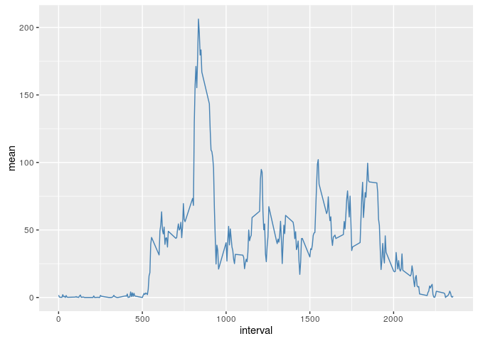

# Reproducible Research: Peer Assessment 1
## Loading some dependencies and stablishing some defaults.

```r
library(knitr)
opts_chunk$set(echo = TRUE)
```
## Loading and preprocessing the data
1. Loading data

```r
file <- unzip("activity.zip", files = "activity.csv")
df <- read.csv(file)
head(df)
```

```
##   steps       date interval
## 1    NA 2012-10-01        0
## 2    NA 2012-10-01        5
## 3    NA 2012-10-01       10
## 4    NA 2012-10-01       15
## 5    NA 2012-10-01       20
## 6    NA 2012-10-01       25
```
2. Processing/transforming the data into a format suitable for your analysis

```r
df$date <- as.Date(df$date, format = "%Y-%m-%d")
head(df)
```

```
##   steps       date interval
## 1    NA 2012-10-01        0
## 2    NA 2012-10-01        5
## 3    NA 2012-10-01       10
## 4    NA 2012-10-01       15
## 5    NA 2012-10-01       20
## 6    NA 2012-10-01       25
```
## What is mean total number  of steps taken per day?
1. Calculate the total number of steps taken per day. 
- First some library we'll need

```r
library(dplyr)
```

```
## 
## Attaching package: 'dplyr'
```

```
## The following objects are masked from 'package:stats':
## 
##     filter, lag
```

```
## The following objects are masked from 'package:base':
## 
##     intersect, setdiff, setequal, union
```
- Grouping by date and summarizing to get the total steps taken per day.

```r
df.by.date <- summarise(group_by(df, date), sum = sum(steps))
head(df.by.date)
```

```
## Source: local data frame [6 x 2]
## 
##         date   sum
##       (date) (int)
## 1 2012-10-01    NA
## 2 2012-10-02   126
## 3 2012-10-03 11352
## 4 2012-10-04 12116
## 5 2012-10-05 13294
## 6 2012-10-06 15420
```
- Because you can ignore the missing values (NA) on this part, will do it

```r
df.by.date <- df.by.date[complete.cases(df.by.date$sum),]
```
2. Make a histogram of the total number of steps taken each day.
We'll do it with ggplot2. Load it and lets plot.

```r
library(ggplot2)
ggplot(df.by.date, aes(x = sum)) +
        geom_histogram(binwidth = 1000) +
        labs(title = "Histogram of the frecuency of Steps per day", x = "Steps per day", y = "Frequency")
```


3. Calculate and report the mean and median of the total number of steps taken per day.

```r
mean.steps <- mean(df.by.date$sum, na.rm = T)
median.steps <- median(df.by.date$sum, na.rm = T)
```
- The mean of the total number of steps taken per day is

```r
mean.steps
```

```
## [1] 10766.19
```
- And the median of the total number of steps taken per day is

```r
median.steps
```

```
## [1] 10765
```
## What is the average daily activity pattern?
1. Make a time series plot of the 5-minute interval (x-axis) and the average number of steps taken, averaged across all days (y-axis).
- First we need to tydi the data.

```r
df.by.interval <- summarise(group_by(df, interval), mean = mean(steps, na.rm = T))
```
- Now we'll plot it

```r
ggplot(df.by.interval, aes(x = interval, y = mean)) + geom_line(col = "steelblue")
```


2. Which 5-minute interval, on average across all the days in the dataset, contains the maximum number of steps?
- The 5-minute interval which on average across all the days in the dataset contains the maximum number of steps is 

```r
max.interval <- max(df.by.interval$mean, na.rm = T)
max.interval
```

```
## [1] 206.1698
```
## Imputing missing values
1. Calculate and report the total number of missing values in the dataset (i.e. the total number of rows with NAs)

```r
sum(is.na(df$steps))
```

```
## [1] 2304
```
2. Devise a strategy for filling in all of the missing values in the dataset. The strategy does not need to be sophisticated. For example, you could use the mean/median for that day, or the mean for that 5-minute interval, etc.

```r
missed <- is.na(df$steps)
interval.mean <- tapply(df$steps, df$interval, mean, na.rm=TRUE, simplify=TRUE)
```
3. Create a new dataset that is equal to the original dataset but with the missing data filled in.

```r
df.full <- df
df.full$steps[missed] <- interval.mean[as.character(df.full$interval[missed])]
head(df.full)
```

```
##       steps       date interval
## 1 1.7169811 2012-10-01        0
## 2 0.3396226 2012-10-01        5
## 3 0.1320755 2012-10-01       10
## 4 0.1509434 2012-10-01       15
## 5 0.0754717 2012-10-01       20
## 6 2.0943396 2012-10-01       25
```
4. Make a histogram of the total number of steps taken each day and Calculate and report the mean and median total number of steps taken per day. Do these values differ from the estimates from the first part of the assignment? What is the impact of imputing missing data on the estimates of the total daily number of steps?
- Group and summarize the data (tydi it) to get the plot

```r
df.full <- summarise(group_by(df.full, date), sum = sum(steps))
```
- Plot the new data

```r
library(ggplot2)
ggplot(df.full, aes(x = sum)) +
        geom_histogram(binwidth = 1000) +
        labs(title = "Histogram of the frecuency of Steps per day with missing data filled", x = "Steps per day", y = "Frequency")
```


- The mean and median total number of steps taken per day with he fixed data are:

```r
mean.steps.full <- mean(df.full$sum)
median.steps.full <- median(df.full$sum)
mean.steps.full
```

```
## [1] 10766.19
```

```r
median.steps.full
```

```
## [1] 10766.19
```
- Do these values differ from the estimates from the first part of the assignment? What is the impact of imputing missing data on the estimates of the total daily number of steps? Well, we'll see the differences:

```r
mean.steps - mean.steps.full
```

```
## [1] 0
```

```r
median.steps - median.steps.full
```

```
## [1] -1.188679
```
- As you can see, just in the median there's a difference of -1.1886792. A difference which means a 10^{-4}%.
- What is the impact of imputing missing data on the estimates of the total daily number of steps? First we need to do some fixes:
- Factorizing the data and putting them together

```r
df.by.date.factor <- cbind(df.by.date, "incomplete")
names(df.by.date.factor)[3] <- "origin"
df.full.factor <- cbind(df.full, "complete")
names(df.full.factor)[3] <- "origin"
df.to.plot <- rbind(df.by.date.factor, df.full.factor)
```
- Plotting now the two datas superimpossed

```r
qplot(sum, data = df.to.plot, fill = origin, binwidth = 1000)
```


In this case, the frecuencies that the histogram shows change
- If you compare the number of dates (i.e. number of cases of the data when they are grouped by date), they vary

```r
length(df.by.date$date)
```

```
## [1] 53
```

```r
length(df.full$date)
```

```
## [1] 61
```
increasing in 8 when we fill the missing values. You can see there on this plot, they filled-fixed data are the red cross that are no superimpossed with the black circles: you can repair by guessing the data of those days without change the original values of the steps takn per days. 

```r
with(df.by.date, plot(date, sum, main = "Comparative datasets with and without fixed-filling", type = "p", col = "black", pch = 19))
with(df.full, points(date, sum, col = "red", pch = 4))
```


## Are there differences in activity patterns between weekdays and weekends?
1. Create a new factor variable in the dataset with two levels – “weekday” and “weekend” indicating whether a given date is a weekday or weekend day.

```r
dayoftheweek <- function(x){
        if(weekdays(x) == "sábado" | weekdays(x) == "domingo") {
        y <- "weekend"
        } else {
                y <- "weekday"
        }
        return(y)
}
df.full.week <- cbind(df.full, sapply(df.full$date, dayoftheweek))
names(df.full.week)[3] <- "wd-we"
head(df.full.week)
```

```
##         date      sum   wd-we
## 1 2012-10-01 10766.19 weekday
## 2 2012-10-02   126.00 weekday
## 3 2012-10-03 11352.00 weekday
## 4 2012-10-04 12116.00 weekday
## 5 2012-10-05 13294.00 weekday
## 6 2012-10-06 15420.00 weekend
```
2. Make a panel plot containing a time series plot of the 5-minute interval (x-axis) and the average number of steps taken, averaged across all weekday days or weekend days (y-axis).
- Tyding data

```r
df.full <- df
df.full$steps[missed] <- interval.mean[as.character(df.full$interval[missed])]
df.full.by.interval.week <- cbind(df.full, sapply(df.full$date, dayoftheweek))
names(df.full.by.interval.week)[4] <- "wdwe"

df.full.by.interval.week <- summarise(group_by(df.full.by.interval.week, interval, wdwe), 
                                      mean = mean(steps, na.rm = T))
```
- Lets plot them

```r
df.full <- df
df.full$steps[missed] <- interval.mean[as.character(df.full$interval[missed])]
df.full.by.interval.week <- cbind(df.full, sapply(df.full$date, dayoftheweek))
names(df.full.by.interval.week)[4] <- "wdwe"

df.full.by.interval.week <- summarise(group_by(df.full.by.interval.week, interval, wdwe), 
                                      mean = mean(steps, na.rm = T))
par(mfrow=c(2,1))
par(mar=c(6,2,2,2))
weekdays <- subset(df.full.by.interval.week, df.full.by.interval.week$wdwe == "weekday")
weekends <- subset(df.full.by.interval.week, df.full.by.interval.week$wdwe == "weekend")
plot(weekdays$interval, weekdays$mean, type = "l", col = "steelblue", 
     main = "Per interval averaged taken steps", sub = "weekdays",
     xlab = "Intervals", ylab = "Average taken steps")
plot(weekends$interval, weekends$mean, type = "l", col = "red", sub = "weekends",
     xlab = "Intervals", ylab = "Average taken steps")
```


